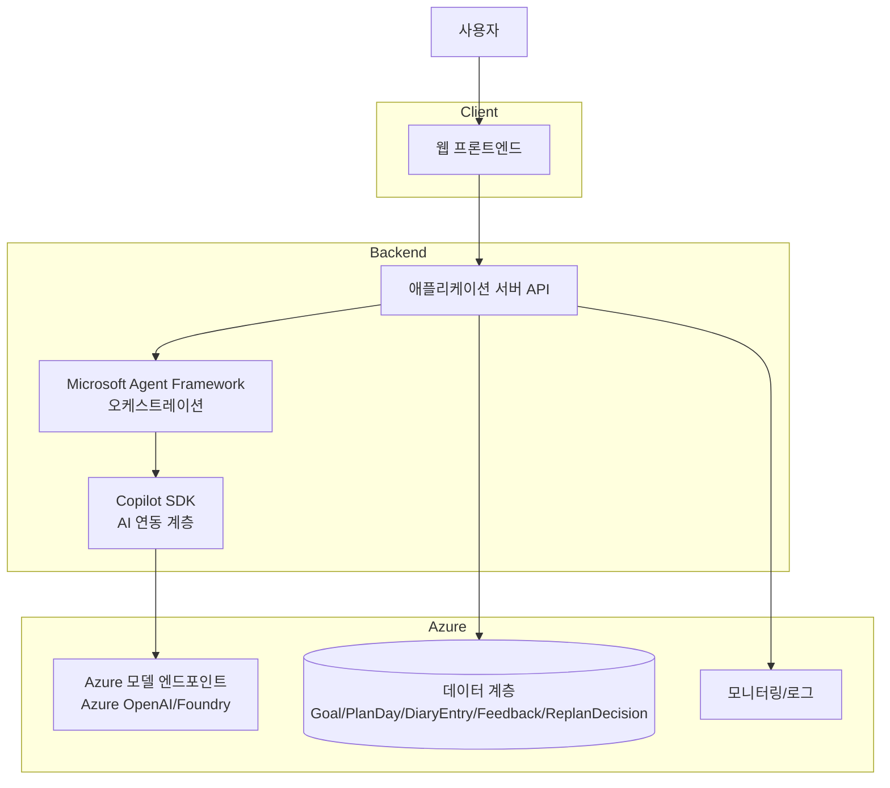

# 성찰 플래너 (Reflection Planner)

## 애플리케이션 개요
성찰 플래너는 사용자가 발전시키고 싶은 목표를 자유롭게 입력하면, AI가 일차 계획을 생성하고 일기 기반 피드백 및 승인형 리플래닝을 통해 실행 루프를 강화하는 개인 생산성 웹앱입니다.

핵심 가치:
- 자유 목표 입력 기반 계획 자동 생성
- 중립형 성찰 피드백 제공
- 사용자 승인형 계획 조정(accept/reject)
- 사용자 계정 없이 시작 가능한 익명 세션 모드

현재 저장소 상태:
- 익명 세션 기반 API와 브라우저 기능 UI가 구현되어 있습니다.
- 저장소는 현재 인메모리 방식이며, 프로세스 재시작 시 데이터가 초기화됩니다.

참고 문서:
- PRD.md
- IDEATION.md
- ARCHITECTURE.md
- TRD.md

## 전체 아키텍처 다이어그램


## 시작하기
이 프로젝트는 현재 문서 기반 기획 단계입니다. 아래 순서로 진행하면 구현 단계로 빠르게 전환할 수 있습니다.

1. PRD 검토: 목표, 범위, 수용 기준 확인
2. 아키텍처 검토: 컴포넌트/데이터모델/정책/시퀀스 확인
3. 구현 스택 확정: 권장 스택(TypeScript 중심) 또는 대안 스택(Python 혼합) 선택
4. MVP 우선순위 고정: 목표 입력 → 계획 생성 → 일기 → 피드백 → 승인형 리플래닝

## 사전 개발 환경 요구사항 (Prerequisites)
권장(1순위) 스택 기준:
- Node.js 20+
- npm 10+
- Git
- GitHub CLI(선택)
- Azure CLI
- Azure 구독 및 배포 권한

권장 서비스(구현/배포 단계):
- Microsoft Agent Framework
- Copilot SDK
- Azure OpenAI 또는 Foundry 모델 엔드포인트
- 데이터 저장소(Cosmos DB 또는 PostgreSQL)
- Docker
- Azure Container Registry(ACR)
- 익명 서버 세션 기반 저장(게스트 모드 MVP)

## 애플리케이션 실행하기 (로컬)

```bash
npm install
npm run build
npm start
```

브라우저에서 `http://localhost:3000`으로 접속합니다. 계정 없이 익명 세션이 자동으로 생성됩니다.

계획 생성과 AI 기능은 Copilot CLI 인증 상태에서 실제 Copilot SDK를 호출합니다. AI 서비스를 사용할 수 없거나 응답 형식이 올바르지 않으면 fallback을 사용하지 않고 오류를 표시합니다.

구현 구조:

1. 웹앱/서버 프로젝트 초기화
- 프론트엔드: Next.js + TypeScript
- 백엔드: Node.js(NestJS/Fastify) + TypeScript

2. 환경 변수 구성
- 모델 엔드포인트 및 API 키
- 데이터베이스 연결 문자열
- 로컬/개발 환경 분리 변수

3. 에이전트 워크플로우 연결
- 계획 생성 워크플로우
- 피드백 생성 워크플로우
- 승인형 리플래닝 워크플로우

4. 기능 확인: 목표 입력 → 계획 생성 → 일기 저장 → 피드백 → 상담 → 조정안 수용/기존 계획 유지

## 애플리케이션 배포하기 (Azure)
Docker 기반으로 Azure에 배포한다.

권장 배포 흐름:
1. 애플리케이션 이미지 빌드
2. Azure Container Registry(ACR)에 이미지 푸시
3. Azure Container Apps 또는 Azure App Service for Containers로 배포
4. 환경 변수/시크릿(AI 키, DB 연결 문자열) 주입
5. 헬스체크 및 로그 확인

권장 최소 구성:
- 컨테이너 레지스트리: Azure Container Registry
- 런타임: Azure Container Apps(권장) 또는 App Service for Containers
- 관측: Application Insights/Log Analytics
- 보안: Key Vault 또는 플랫폼 시크릿 사용

## 애플리케이션 테스트하기
테스트 전략(권장):
1. 단위 테스트
- 입력 스키마 검증
- 정책 엔진(평가 톤/금지 문구/리플래닝 분기)

2. 통합 테스트
- API ↔ Microsoft Agent Framework ↔ Copilot SDK 연결
- 모델 실패/재시도/에러 핸들링

3. E2E 테스트
- 목표 입력 → 계획 생성 → 일기 작성 → 피드백 확인 → 수용/거절 분기
- 게스트 모드 생성/조회/삭제 흐름

4. 비기능 테스트
- 응답시간 목표(체감 5초 이내)
- 로그/모니터링 지표 검증
- 장애 시 데이터 보존 및 재시도 UX 검증

## 심사 기준

전체 배점은 100%입니다.

| 기준 | 비중 |
|---|---:|
| Copilot SDK·Microsoft Agent Framework 활용 | 25% |
| 생산성 향상 및 문제 적합성 | 18% |
| Azure 클라우드 연동 | 18% |
| 기능 완성도 및 기술 구현 | 16% |
| 사용자 경험 및 워크플로 설계 | 12% |
| 책임 있는 AI·보안·신뢰성 | 6% |
| 혁신성 및 독창성 | 5% |

심사 데모는 계정 없이 목표를 입력하고, AI 계획 생성·일기 피드백·상담·승인형 리플래닝까지 한 번에 보여주는 흐름으로 진행한다. 각 단계에서 Copilot SDK, Microsoft Agent Framework, Azure 배포와 책임 있는 AI 정책의 동작 근거를 함께 제시한다.
