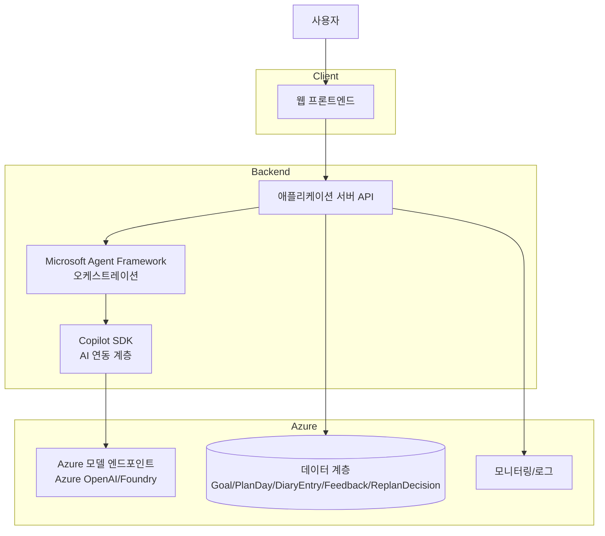

# 성찰 플래너 (Reflection Planner)

## 애플리케이션 개요
성찰 플래너는 사용자가 발전시키고 싶은 목표를 자유롭게 입력하면, AI가 일차 계획을 생성하고 일기 기반 피드백 및 승인형 리플래닝을 통해 실행 루프를 강화하는 개인 생산성 웹앱입니다.

핵심 가치:
- 자유 목표 입력 기반 계획 자동 생성
- 중립형 성찰 피드백 제공
- 사용자 승인형 계획 조정(accept/reject)
- 로그인 없이 시작 가능한 게스트 모드

현재 저장소 상태:
- 본 저장소는 기획/요구사항/아키텍처 문서 중심 단계입니다.
- 구현 코드는 아직 포함되어 있지 않습니다.

참고 문서:
- PRD.md
- IDEATION.md
- ARCHITECTURE.md

## 전체 아키텍쳐 다이어그램


## 시작하기
이 프로젝트는 현재 문서 기반 기획 단계입니다. 아래 순서로 진행하면 구현 단계로 빠르게 전환할 수 있습니다.

1. PRD 검토: 목표, 범위, 수용 기준 확인
2. 아키텍처 검토: 컴포넌트/데이터모델/정책/시퀀스 확인
3. 구현 스택 확정: 권장 스택(TypeScript 중심) 또는 대안 스택(Python 혼합) 선택
4. MVP 우선순위 고정: 목표 입력 → 계획 생성 → 일기 → 피드백 → 승인형 리플래닝

## 사전개발 환경 요구사항 (Prerequisites)
권장(1순위) 스택 기준:
- Node.js 20+
- npm 10+
- Git
- GitHub CLI(선택)
- Azure CLI
- Azure 구독 및 배포 권한

권장 서비스(구현/배포 단계):
- Microsoft Agent Framework
- Copilot SDK
- Azure OpenAI 또는 Foundry 모델 엔드포인트
- 데이터 저장소(Cosmos DB 또는 PostgreSQL)

## 애플리케이션 실행하기 (로컬)
현재는 실행 가능한 애플리케이션 코드가 없어 로컬 실행은 불가능합니다.

대신 구현 시작 시 아래 흐름을 권장합니다.

1. 웹앱/서버 프로젝트 초기화
- 프론트엔드: Next.js + TypeScript
- 백엔드: Node.js(NestJS/Fastify) + TypeScript

2. 환경 변수 구성
- 모델 엔드포인트 및 API 키
- 데이터베이스 연결 문자열
- 로컬/개발 환경 분리 변수

3. 에이전트 워크플로우 연결
- 계획 생성 워크플로우
- 피드백 생성 워크플로우
- 승인형 리플래닝 워크플로우

4. 로컬 실행(예시)
```bash
# frontend
npm install
npm run dev

# backend
npm install
npm run dev
```

## 애플리케이션 배포하기 (Azure)
추후 작성

## 애플리케이션 테스트하기
테스트 전략(권장):
1. 단위 테스트
- 입력 스키마 검증
- 정책 엔진(평가 톤/금지 문구/리플래닝 분기)

2. 통합 테스트
- API ↔ Agent Framework ↔ Copilot SDK 연결
- 모델 실패/재시도/에러 핸들링

3. E2E 테스트
- 목표 입력 → 계획 생성 → 일기 작성 → 피드백 확인 → 수용/거절 분기
- 게스트 모드 생성/조회/삭제 흐름

4. 비기능 테스트
- 응답시간 목표(체감 5초 이내)
- 로그/모니터링 지표 검증
- 장애 시 데이터 보존 및 재시도 UX 검증
